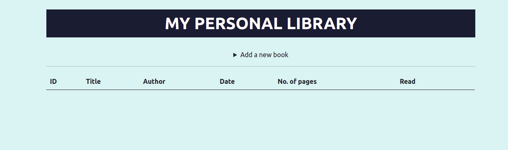

# library

### You can access a Live Demo [HERE](https://rawcdn.githack.com/atenaiis/library/a16dcf40026a195dba8f61beeb18898a5c9f83e8/index.html)

## Features Built

- Register new Books
- See Registered Books
- Remove Registered Books
- Change the status of registered books

## Built With

- HTML5
- Bootstrap
- Javascript

## Getting Started

To get a local copy up and running follow these simple steps.

- Clone this repository
 > `git clone <git@github.com:atenaiis/library.git>`
- Navigate to the Repo Folder
- Use your favorite browser the index.html file (located at the root)
- Warning: be aware that the registered books will be only available on the browser it was registered.

## Authors

👤 **Atenais Campos**

- Github: [@atenaiis](https://github.com/atenaiis)
- Twitter: [@spranomarian](https://twitter.com/SopranoMarian)
- Linkedin: [linkedin](https://www.linkedin.com/in/mariana-atenai-campos-garcia-a30791143/)

## 🤝 Contributing

Contributions, issues and feature requests are welcome!

Feel free to check the issue page

## Show your support

Give a ⭐️ if you like this project!
